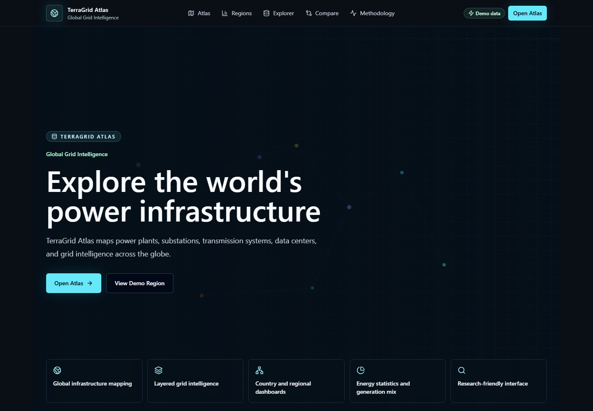
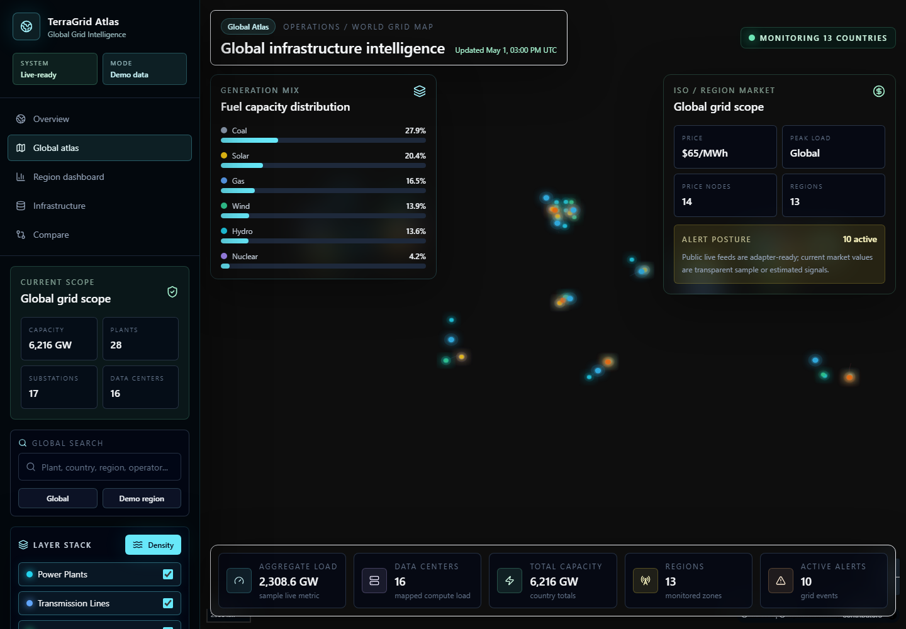
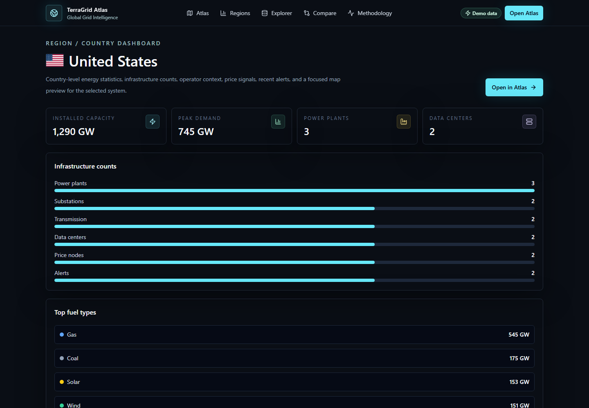
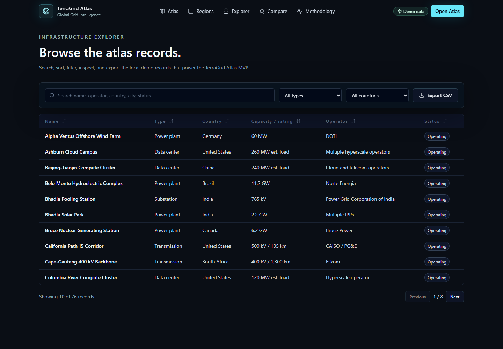
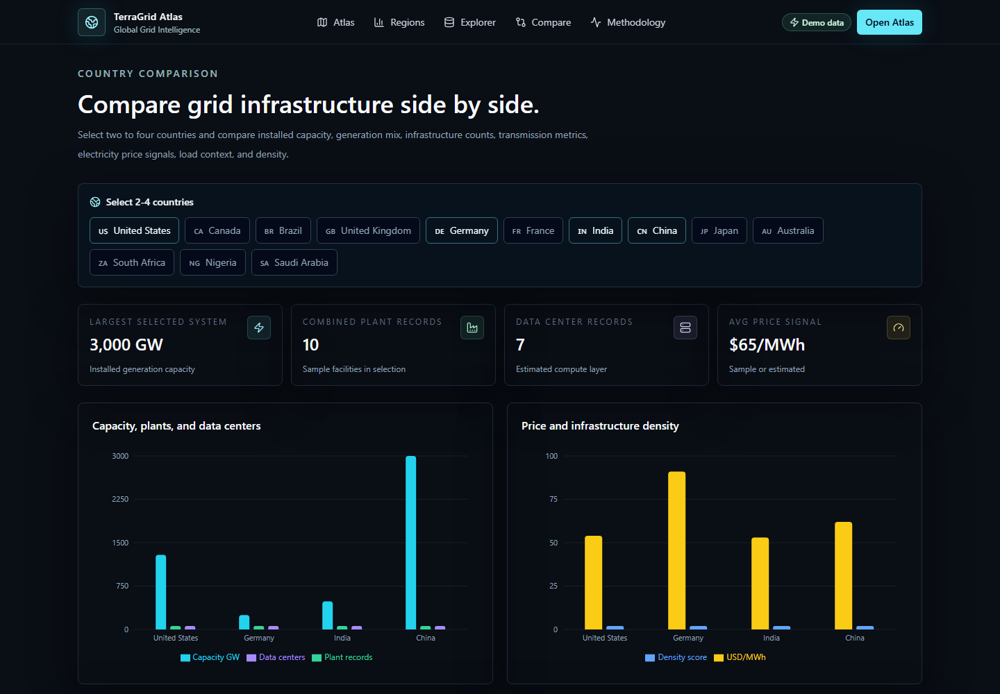
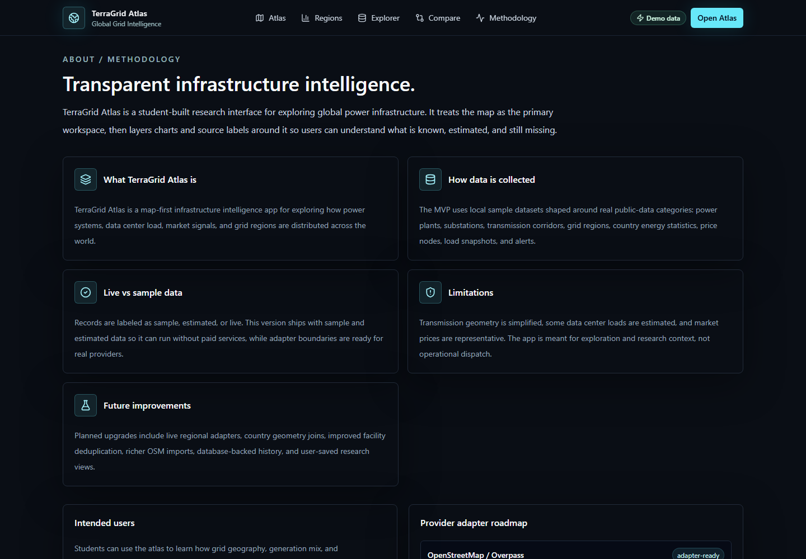

# TerraGrid Atlas

**Global Grid Intelligence**

> Explore the world's power infrastructure.

[Live demo pending final Vercel deployment.]

TerraGrid Atlas is a production-ready Next.js web app for exploring global electricity and energy infrastructure through an interactive map, infrastructure explorer, and country-level analytics dashboards.

I built TerraGrid Atlas because energy infrastructure data is often fragmented, paywalled, or difficult to explore. I wanted one place where students, researchers, and citizens could visually understand how power systems are distributed and connected across the world.

## Features

- Full-screen global MapLibre atlas with a dark basemap
- Layer toggles for power plants, transmission lines, substations, data centers, grid regions, price nodes, interconnections, alerts, and country statistics
- Search and filters for country, continent, fuel type, capacity range, voltage class, infrastructure type, status, operator, year, and data mode
- Clustered infrastructure points, hover tooltips, click popups, country zooming, and density mode
- Collapsible intelligence dashboard with global and selected-country metrics
- Country dashboards with generation mix, fuel capacity, infrastructure counts, load history, alerts, operators, and map preview
- Infrastructure explorer with sorting, filtering, pagination, row detail drawer, and CSV export
- 2-4 country comparison dashboard
- Transparent methodology page explaining sample, estimated, and live-ready data modes

## Tech Stack

- Next.js App Router
- TypeScript
- Tailwind CSS
- shadcn/ui-inspired local components
- MapLibre GL JS
- Recharts
- lucide-react
- Local JSON sample datasets
- Adapter-ready data architecture
- Vercel-ready deployment

## Architecture

```text
app/
  atlas/                 Interactive global atlas
  compare/               Country comparison dashboard
  dashboard/[country]/   Region / country intelligence view
  explorer/              Searchable infrastructure table
  methodology/           About and data methodology
components/
  atlas/                 Atlas workspace state
  charts/                Recharts visualizations
  compare/               Comparison dashboard
  dashboard/             Country stats and map preview
  explorer/              Table and detail drawer
  map/                   MapLibre map, layers, filters, dashboard
  ui/                    shadcn-style primitives
data/sample/             Local JSON datasets
lib/data/                Types, adapters, constants, aggregations
```

## Data Model

The project defines typed interfaces for:

- `PowerPlant`
- `TransmissionLine`
- `Substation`
- `DataCenter`
- `CountryEnergyStat`
- `GridRegion`
- `PriceNode`
- `GridAlert`
- `LiveMetric`
- `GenerationMix`

The MVP uses local JSON data, but all datasets are loaded through adapter boundaries in `lib/data/adapters.ts`. This keeps the app ready for future live sources without rewriting the UI.

## Map Layers

- Power Plants
- Transmission Lines
- Substations
- Data Centers
- Grid Regions / Operators
- Price Nodes
- Interconnection Corridors
- Alerts / Outages
- Country Energy Stats

## Public Data Sources to Support

The adapter roadmap is structured for sources such as:

- OpenStreetMap / Overpass
- Global Power Plant Database
- World Bank, IEA, and Ember-style country energy metrics
- ENTSO-E-style load, price, and market data where available
- EIA-style fuel mix and generation data where available
- Public data center and transmission geometry datasets

## Demo Data Explanation

This repository ships with realistic sample and estimated records for:

- United States
- Canada
- Brazil
- United Kingdom
- Germany
- France
- India
- China
- Japan
- Australia
- South Africa
- Nigeria
- Saudi Arabia

Records are labeled as `sample`, `estimated`, or `live`. The current MVP intentionally runs without a required database or paid API service.

## Screenshots

### Landing Page



### Global Atlas



### Country Dashboard



### Infrastructure Explorer



### Compare Countries



### Methodology



## Pages

- `/` - Landing page
- `/atlas` - Full-screen global infrastructure atlas
- `/dashboard/US` - Example country dashboard
- `/explorer` - Infrastructure record explorer
- `/compare` - Country comparison workspace
- `/methodology` - Data methodology and limitations

## Local Setup

```bash
npm install
npm run dev
```

Open [http://localhost:3000](http://localhost:3000).

## Verification

```bash
npm install
npm run typecheck
npm run lint
npm run build
```

## Production Build

```bash
npm run build
npm run start
```

## Future Improvements

- Add live provider adapters for regional load, price, outage, and generation feeds
- Add database-backed historical metrics and saved research views
- Import real OSM/Overpass infrastructure geometries
- Add country boundary joins and richer choropleth layers
- Improve facility deduplication and source confidence scoring
- Add authentication for saved workspaces
- Add downloadable methodology reports

## Limitations

- The included dataset is representative, not exhaustive
- Transmission line geometries are simplified
- Some data center loads and market prices are estimated
- This app is for research exploration, not operational dispatch or emergency response

## Suggested Repo Metadata

- Repo name: `terragrid-atlas`
- Description: `A global interactive atlas for exploring power plants, substations, transmission, data centers, and grid intelligence.`
- Topics: `nextjs`, `typescript`, `tailwindcss`, `maplibre`, `energy`, `infrastructure`, `power-grid`, `geospatial`, `recharts`, `open-data`
